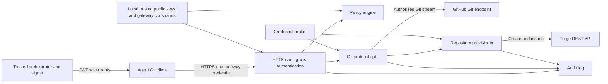

# Git permission gateway: initial requirements and design

Status: proposal, 2026-09-23. Implementation language: Go. Initial upstream: GitHub organizations; other Git forges follow through adapters.

Build an HTTPS endpoint that agents use as their Git remote. The gateway authenticates each agent, applies repository and ref permissions, and forwards permitted operations using credentials held by the gateway. It also creates missing repositories when a separate creation grant permits it. GitHub remains the source of truth for objects and refs.

The intended operational improvement is one gateway identity per agent, usable across its permitted repositories, rather than a collection of upstream tokens per agent/repository/branch. The gateway still needs to distinguish agents; sharing a single agent credential would defeat selective access and attribution.

## Proposed scope and decisions

| Topic | Initial proposal |
| --- | --- |
| Transport | Git smart HTTP over TLS: require protocol v2 for upload-pack (fetch and ref lookup); retain the current v0 receive-pack protocol for pushes. Native `git://` and SSH are excluded initially. |
| Reads | Branch-scoped ref discovery and name resolution; repository-authorized object reads by hash without gateway per-object ACLs. This reduces incidental discovery rather than isolating object contents. |
| Writes | Separate create, update, and delete grants on fully qualified refs. Every command in a push must pass. |
| History rewrites | An update grant permits both fast-forward and non-fast-forward updates on that ref, subject to upstream restrictions. No gateway fast-forward-only guarantee in the first release. |
| Missing repositories | Opt-in creation during authorized push discovery, under an allowed owner and name pattern. Private, empty repositories initially. |
| Authentication | Signed, short-lived JWTs carry agent permissions and are used as HTTPS passwords. Operator-provided upstream tokens are shared across agents and repositories. No GitHub App required. |
| Storage | No per-agent credential/permission lookup on the proxy. Keep verifier/configuration state, provisioning coordination and audit records; stream Git objects without a persistent mirror. |
| Other forges | Provider interface from the start; only GitHub is a release requirement. |

**Confirmed read intent:** keep agents from casually discovering branches outside their assignments, while allowing retrieval by known object hash within an authorized repository. Filter ref names and their tip mappings, including push advertisements; do not perform object reachability authorization. An agent that learns a hidden branch's commit hash elsewhere may fetch it if the upstream serves it. Shared history, merge messages, and object contents can also reveal information; objects are not scrubbed. This is the intended boundary, consistent with Git's warning that ref hiding does not provide object confidentiality. [Git namespace security](https://git-scm.com/docs/gitnamespaces#_security)

## Requirements

| ID | Requirement |
| --- | --- |
| R1 | Standard Git clients configured for protocol v2 can clone, fetch, list refs, and push using standard credential helpers. The push path accepts their normal v0 receive-pack exchange. |
| R2 | A principal sees only granted refs in an authorized repository, can fetch by hash without per-object ACLs, and can write only granted destination refs. Access to other repositories is denied by default. |
| R3 | Authorize the destination ref, including explicit refspecs, tags, deletions, and multi-ref pushes. Client branch names and CLI flags are not trusted. |
| R4 | Reject the entire push before forwarding its receive-pack request if any command is unauthorized. Never silently drop commands from a push. |
| R5 | Repository creation requires its own grant, a permitted namespace/name, and server-controlled settings. Branch write access alone does not permit creation. |
| R6 | Concurrent creation attempts converge on one repository; retries do not loosen policy or overwrite an existing repository. |
| R7 | Agents never receive upstream credentials. Requests cannot select arbitrary upstream hosts or bypass the gateway through its endpoints. |
| R8 | Validate JWT expiry on every request. Issuer policy changes take effect through replacement tokens; old grants remain valid until expiry unless locally overridden. Document that bound. Discovery does not authorize a later push. |
| R9 | Audit decisions and outcomes by principal, repository, destination ref, policy revision, and upstream request identifiers where available. |
| R10 | Bound memory, request size, concurrency, provisioning rate, and request duration. Stream large packs with backpressure. |
| R11 | GitHub permissions and repository rules remain additional restrictions. The gateway cannot promise acceptance of a push that GitHub rejects. |
| R12 | Malformed protocol input, unknown write-affecting extensions, unavailable policy, and ambiguous provisioning results fail closed. |
| R13 | Apply ref visibility to every structured advertisement/name-resolution path, including upload-pack, receive-pack, symbolic refs and tags. A read-only filter must not be bypassable through push discovery. |

Initial exclusions: SSH, anonymous access, dumb HTTP object endpoints, Git LFS, arbitrary GitHub REST/GraphQL proxying, pull request management, file/path ACLs, commit-author enforcement, and repository deletion/transfer/visibility changes. Submodules work only if each submodule URL independently routes through an authorized gateway remote. LFS needs a separate design for its API, object URLs, and authentication.

Branch grants permit changes to any file on the branch, including workflow definitions. They do not sandbox CI triggered by those changes; repository workflow permissions, secrets, and privileged automation must be configured for agent-written branches. This is an operational dependency of branch write access.

The trust boundary assumes agents cannot obtain gateway upstream credentials, change gateway policy, or use another identity with broader forge access. The gateway governs traffic sent through it; deployments must remove alternative write credentials from agent environments. Gateway operators, the control plane, and configured upstream services are trusted. Do not give the upstream account a repository-rule bypass role by default.

## Permission model

Evaluate `(principal, provider, owner, repository, action, ref, context)` against the verified JWT's embedded grant and a local gateway configuration snapshot. Context includes issuer, subject, audience, token expiry and task identity. The trusted issuer checks its own policy before signing. Effective authority at the proxy is the intersection of signed grants and gateway-wide constraints; upstream permissions apply independently. There is no token-to-permissions lookup or per-agent policy fetch on the request path.

| Action | Meaning |
| --- | --- |
| `repo.read` | Access Git read services and request objects by hash within this repository. Does not itself expose ref names or authorize another repository. |
| `ref.discover` | List a matching ref and resolve its name to an object ID. Also controls its appearance in push discovery. |
| `repo.create` | Provision a repository matching an owner/name grant and a configured creation profile. Does not itself grant read or push access. |
| `ref.create` | Push a ref whose old object ID is zero and new object ID is nonzero. |
| `ref.update` | Change an existing ref to a nonzero object ID, including history rewrites. |
| `ref.delete` | Delete an existing ref. Requires an explicit grant. |

The compact JWT rule language is specified in [JWT permission syntax, version 1](permission-syntax.md):

```text
[!]host/namespace/repository[#ref-selector]:actions
```

Repository paths support bounded globs and alternatives; hosts are exact configured authorities. Ref selectors use branch names by default and explicit `refs/tags/` for tags. `r` compiles to repository hash-read access plus matching ref discovery; `w` to ref creation/update; `d` to ref deletion; and `c` to repository creation. Rules without a ref selector apply across supported branches and tags; `#*` means branches only. Branch-scoped `r` never implies per-object read isolation.

Allows accumulate and explicit denies win, regardless of ordering or specificity. A broad read grant stays broad when a narrow grant is added. A ref write still requires effective repository read and ref discovery, which may come from another matching rule. Whole-repository read denies block repository reads; ref-scoped read denies only hide matching refs and block writes requiring their discovery, leaving known-hash reads available.

Illustrative signed grant fragment (identity, audience, lifetime and signature fields omitted):

```json
{
  "grant": {
    "v": 1,
    "permissions": [
      "github.com/acme/platform#main:r",
      "github.com/acme/platform#agents/agent-47/*:rw",
      "github.com/acme-sandbox/agent-47-*:rc",
      "github.com/acme-sandbox/agent-47-*#agents/agent-47/*:rw",
      "!github.com/acme/platform#main:wd"
    ]
  }
}
```

This exposes main and the agent's branches in platform, permits only its own branch writes, and allows creation of matching scratch repositories with broader read visibility there. Creation uses the route's server-controlled private profile; `c` alone grants no read or write access. Unsupported ref namespaces remain inaccessible. Tags require a matching explicit tag selector or a whole-repository grant.

Bind enrolled existing repositories to stable provider IDs so deletion/recreation or transfer cannot silently substitute a different repository. The signer may alternatively supply signed bindings for exact identity pinning. Unbound wildcard name grants deliberately cover current and future matching repositories, subject to local configured owner access. Validate and activate local policy/configuration revisions atomically, with explanation output for administrative review.

There is no trustworthy “force” flag in the wire command: old/new object IDs do not establish ancestry. Adding a distinct force-push permission requires object graph validation, including newly supplied and thin-pack objects, or verified upstream rules that enforce it for every relevant ref without a bypass. The initial gateway must not claim to distinguish fast-forward updates from rewrites by inspecting the command header alone. The protocol encodes create/update/delete through ref names and object IDs. [Git pack protocol](https://git-scm.com/docs/pack-protocol)

## Architecture and Go boundaries



Use Go `net/http` for routing and transport, with an explicit protocol gate ahead of forwarding. A general reverse proxy alone cannot enforce ref permissions. Suggested packages:

| Package | Responsibility |
| --- | --- |
| `internal/authn` | Verify JWT signatures and claims using configured public keys; extract signed principals and grants without per-agent lookups. |
| `internal/policy` | Validate configuration, compile selectors, make deterministic decisions. No network calls. |
| `internal/gitwire` | Bounded pkt-line parser, v2 command inspection, ref advertisement filtering, receive-pack command extraction, capability handling and status parsing. |
| `internal/gateway` | Endpoint handling, authorization sequence, streaming, HTTP error behavior. |
| `internal/forge` | Provider registry, repository inspection/creation, canonical identifiers and capability declarations. |
| `internal/credentials` | Resolve operator-provided secret references, select credentials for configured providers, and reload rotated secrets. Optional future credential issuers fit behind the same interface. |
| `internal/provision` | Creation coordination, durable attempts, reconciliation and quotas. |
| `internal/audit` | Decision and outcome events with redaction. |

Keep REST API clients separate from the Git HTTP transport. A provider adapter supplies Git/API base URLs and authentication conventions and implements `LookupRepository`, `CreateRepository`, and creation-profile validation. Return typed outcomes such as found, absent, inaccessible/unknown, conflict, rate-limited, and transient failure; do not flatten all failures into “not found.” Capability declarations prevent generic policy from implying unsupported provider guarantees.

JWT authentication and grant evaluation need only local verifier keys and gateway configuration. A transactional store is still useful for repository identity/provisioning records, quota reservations and an audit outbox; PostgreSQL is a proposed production choice for multiple replicas, not an authentication dependency. Process-local locks alone cannot coordinate creation across replicas. The orchestrator owns any durable agent/issuer policy state. Git data requests remain independent of replica affinity.

## Identity and credentials

Use **HTTPS only on both sides, with a signed JWT as the agent's password**. The JWT carries concrete permissions; no opaque token database or role-to-permissions service is needed by the proxy. Do not implement an SSH listener, upstream SSH adapter, or second agent-authentication scheme initially. HTTPS still carries v2 fetch and the existing receive-pack push format.

Issuance and use:

1. The trusted orchestrator selects the task's permitted providers, repositories, ref selectors and actions; repository creation profiles stay in gateway configuration. A local signing utility/library signs that grant using an operator-controlled asymmetric private key. Agents never receive the signing key.
2. Inject the JWT into the agent's mounted secret file or environment. A small Git credential helper supplies a fixed username and the JWT as password **only for the exact proxy HTTPS host and port**. The subject comes from the verified JWT, never the Basic username. Standard Git supports password delivery through credential helpers. [Git credentials](https://git-scm.com/docs/gitcredentials)
3. Each proxy replica verifies the signature with locally configured public keys, validates claims, and evaluates the embedded grant. It neither stores issued tokens nor calls the orchestrator during Git requests. A configured issuer/key is trusted only within its configured provider/owner authority.
4. The orchestrator supplies a fresh signed token before expiry, re-evaluating the task's permissions. A file-backed helper reads the replacement when Git asks for credentials. Stop issuing tokens when the task ends. Renewal is orchestrator-driven; possession of an old JWT does not grant indefinite renewal rights.

The claim schema includes `iss`, `sub`, `aud`, `iat`, `nbf`, `exp`, and `jti`, plus a versioned `grant` containing the compact `permissions` string array, where leading `!` denotes a deny rule. `jti` is an audit identifier, not a database key or single-use nonce; Git uses the same JWT across multiple requests. Bind existing-repository grants to provider IDs where available; future-name repository creation grants remain explicitly name-scoped. Include an issuer policy revision for audit, not as a reference the proxy must dereference. JWTs carry no upstream token, private key or other embedded secret: signed claims are readable by their holder. [JWT claims](https://www.rfc-editor.org/rfc/rfc7519.html)

Use one explicitly configured asymmetric signing algorithm and a maintained JWT implementation. Require a valid signature, expected token type, trusted issuer, exact service audience, subject, supported grant version and valid time claims. Reject unknown permission fields/operators rather than silently ignoring them. Select verification keys by a bounded local `kid` mapping; do not follow token-supplied key URLs or accept embedded replacement keys. This follows JWT validation guidance. [JWT best practices](https://www.rfc-editor.org/rfc/rfc8725.html)

Proposed lifetime: 15 minutes, with at most 30 seconds of clock tolerance; verify both expiration and maximum issued lifetime. Issuer policy changes or task termination do not invalidate an already issued JWT. In the base design, its remaining lifetime plus clock tolerance is the revocation bound for newly admitted requests. Immediate per-agent/per-token revocation would require additional denylist state and is deferred. Removing a trusted signing key or tightening local gateway constraints is an emergency broad control, not selective token revocation. Normal key rotation overlaps verification keys until old tokens expire.

Authorize every HTTP request again, including after discovery. Revalidate expiry after waiting for provisioning coordination and before starting a create operation. An admitted transfer may finish under its verified grant/configuration snapshot, subject to a transfer deadline; expiry cannot undo an upstream write already accepted. Refresh ahead of multi-request Git operations; if a later request finds the token expired, the helper obtains the newly injected token and the client may need to retry. Record token `jti`, issuer policy revision and gateway configuration revision in audit.

**Token size is a deployment contract.** JWTs can carry multiple repositories and ref rules, but keep grants limited to the task. Under HTTP Basic, the header is `Authorization: Basic base64(username:JWT)`; its size is approximately 4/3 of the serialized JWT, which itself base64url-encodes its JSON. Budget roughly 1.8 times the raw claims JSON plus signature/header overhead. The token is sent on every authenticated Git HTTP request.

The documented Git credential-helper format allows up to 65,535 bytes per attribute line, including the key and newline. HTTP infrastructure often limits credentials sooner: nginx defaults to an 8 KiB buffer per HTTP/1 header field; Go's server default is 1 MiB for request headers and is configurable. These are component limits, not an end-to-end guarantee. [Git credential format](https://git-scm.com/docs/git-credential#_input_output_format), [nginx header limits](https://nginx.org/en/docs/http/ngx_http_core_module.html#large_client_header_buffers), [Go header limits](https://pkg.go.dev/net/http#DefaultMaxHeaderBytes)

Start with a proposed 4 KiB serialized-JWT budget (about 5.4 KiB for the Basic header). Make the maximum configurable; a controlled deployment could support 32 KiB JWTs with roughly 43 KiB Authorization fields by configuring and testing every ingress/client/server hop. Enforce the same cap at issuance and verification, with additional limits on rule count and parsing depth. Do not silently truncate grants or broaden them to fit. Use the permission language's alternatives and deliberate repository/branch globs where they express the intended permissions; measure actual token sizes before choosing a deployment limit. For much larger inventories, issue narrower task tokens or explicitly raise the tested limit. A role ID that requires a live permission lookup would abandon the intended self-contained grant model.

**Default upstream authentication: one operator-provided token per configured forge/account scope, reused for all authorized agents.** The proxy owns agent and branch authorization. It does not mint an upstream credential for each agent, branch, repository, or request. A single token may serve multiple configured owners when the forge and token permit it. GitHub personal access tokens work for both Git over HTTPS and API requests; fine-grained tokens are limited to one resource owner, so some deployments will need a small number of centrally managed tokens. [GitHub token documentation](https://docs.github.com/en/authentication/keeping-your-account-and-data-secure/managing-your-personal-access-tokens)

Bootstrap and runtime flow:

1. The operator chooses an existing forge account or a dedicated automation account, gives it the intended repository and creation access, and creates a token with the required permissions. Token type follows the organization's supported policies and required operations.
2. Supply the token through an explicit environment-variable or mounted-file secret reference. Configure Git/API base URLs and map permitted owners to that credential. A secret-manager integration is optional; it is not required to run the service.
3. Resolve the secret at startup and on explicit reload. Authenticate upstream requests with that token only after gateway authorization. Git HTTPS and REST may use different header formats, handled by the adapter, while sharing the same secret.
4. For rotation, install the replacement secret and reload atomically. New requests use the replacement; existing transfers may finish with the credential they started with. Revoke the old credential after draining those requests. Environment-based replacements require a process restart. Static tokens are replaced by the operator, not automatically renewed by the proxy.
5. Missing, expired, or revoked credentials produce an operational error for the affected provider; never fall back to a developer's local login. Keep secret values out of configuration inspection, logs, agent responses, and clone URLs.

Illustrative server configuration, independent of agent grants:

```yaml
providers:
  company-github:
    kind: github
    git_base_url: https://github.com
    api_base_url: https://api.github.com
    allowed_owners: [acme]
    credential:
      kind: token
      secret_ref: file:/run/secrets/github-token
    # Optional api_credential overrides this for provisioning.
    # Otherwise Git and API calls share the credential above.
```

Repository creation uses the same token by default. For GitHub organization creation, the credential must satisfy the API's permission requirements (Administration write for fine-grained tokens), and its account must be allowed to create repositories. Verify that the chosen token can also access newly created repositories; selecting only existing repositories may not cover them. Test the intended access configuration rather than provisioning a new token per repo. An optional separate API credential is supported when an operator wants to separate creation privileges, but is not required by this design. Workflow-file pushes and organization rules also need an integration test for the chosen account/token. [GitHub repository creation API](https://docs.github.com/en/rest/repos/repos#create-an-organization-repository)

**SSH is a valid alternative for upstream Git authentication.** A key attached to an account can access multiple repositories that account can access; GitHub deploy keys are repository-specific and do not fit the shared-credential goal. [GitHub machine users and deploy keys](https://docs.github.com/en/authentication/connecting-to-github-with-ssh/managing-deploy-keys)

SSH does not replace the API token needed for repository creation: GitHub REST authenticates with tokens. [GitHub API authentication](https://docs.github.com/en/rest/authentication/authenticating-to-the-rest-api) An SSH upstream would therefore use an account key for Git plus an API token, while agents continue using HTTPS. It also needs an HTTPS-to-SSH Git transport adapter with host-key verification, bounded SSH sessions, correct v2 negotiation, and safe repository command construction. Token-authenticated HTTPS remains the first implementation because it supports Git and creation through one credential and preserves the HTTP streaming architecture. Upstream SSH is an optional extension; client-facing SSH remains out of scope.

GitHub App token issuance is an optional future credential provider for installations that want it. App registration, installation management, and token minting are not prerequisites or initial release work. Other forge adapters likewise accept operator-provided tokens and define their Git/API authentication conventions.

The upstream sees the shared account as the authenticated actor. Per-agent attribution belongs in the gateway audit trail; commit authors are not a substitute for the authenticated principal.

## Git request handling

Example remote: `https://git-gateway.example/company-github/acme/platform.git`.

The provider alias resolves through server-owned configuration. Parse once into a canonical repository identity, validate the original escaped path, and use the same identity for policy and upstream URL construction. Reject traversal, encoded separators, ambiguous suffixes, userinfo, unexpected query parameters, and noncanonical forms rather than allowing multiple layers to interpret them differently.

Accept only these Git endpoints:

| Endpoint | Authorization |
| --- | --- |
| `GET .../info/refs?service=git-upload-pack` | `repo.read`; require v2 and return only approved capabilities |
| `POST .../git-upload-pack` | `repo.read`, checked again; inspect v2 command and apply ref visibility where relevant |
| `GET .../info/refs?service=git-receive-pack` | `repo.read` plus at least one discoverable write grant; filter advertised refs; missing repository also requires creation eligibility |
| `POST .../git-receive-pack` | `repo.read` plus `ref.discover` and the required write action for every parsed destination ref |

Discovery and transfer are distinct requests. A caller can construct a POST without discovery, so no security decision may depend on the caller having completed discovery first. The endpoint split follows Git smart HTTP. [Git HTTP protocol](https://git-scm.com/docs/http-protocol)

**Protocol choice.** Require v2 for upload-pack on both client and upstream connections. Reject older fetch requests and upstream downgrade responses before relaying refs. Configure agent Git with `protocol.version=2`; that preference alone does not enforce the requirement, so the gateway verifies negotiation and each POST's framing. Keep protocol v0 for receive-pack: Git's current HTTPS client explicitly falls back from v2 for push. Rejecting all old-protocol traffic would therefore break ordinary pushes. [Git HTTPS transport implementation](https://github.com/git/git/blob/master/remote-curl.c)

V2 separates capabilities, `ls-refs`, and `fetch`, making discovery interception cleaner and avoiding an unconditional full ref advertisement. Its `ref-prefix` is an optimization, not an access check: servers may return extra refs. The proxy must filter responses itself. [Git protocol v2](https://git-scm.com/docs/protocol-v2)

**Ref discovery and resolution.** Proposed enforcement rules:

1. For v2 `ls-refs`, expose only entries allowed by `ref.discover`, further narrowed by client-requested prefixes when present. A missing/broad prefix means all *permitted* refs. Forward narrower prefixes upstream when useful, but always filter returned records.
2. For symbolic refs, including unborn `HEAD`, expose the record only when its target is discoverable. Hide detached `HEAD` initially unless an explicit supported policy defines its visibility. If the upstream default branch is hidden, omit `HEAD` instead of inventing a tip or target; the caller uses `clone --branch <visible-branch>` or fetches a visible branch explicitly.
3. Filter tags and peeled records consistently. A visible tag may intentionally provide another name for a commit; tags therefore require their own discovery grant.
4. Apply the same visibility rules to the older receive-pack advertisement. Remove hidden ref records, auxiliary `.have` records, and hidden symbolic-target capabilities. Re-encode capability placement when the first surviving ref changes; if none remain, emit the valid zero-ID `capabilities^{}` placeholder without a hidden tip. Exercise empty and nonempty filtered views with real clients.
5. Reject unimplemented ref-resolving extensions. Initially mask `ref-in-want` and reject `want-ref`, reject `deepen-not`, and reject server-specific options. A later implementation may authorize fully qualified named targets explicitly; do not pass arbitrary revision expressions upstream for resolution. Only known safe partial-clone filter forms may be passed through; exclude filters that resolve ref/revision names.

**Object fetch.** Inspect the bounded v2 request before forwarding, then stream the pack response. Permit well-formed `want <oid>` and negotiation hashes without checking whether they belong to visible refs. Preserve upstream object availability rules: the gateway promises no additional per-object ACL, not that GitHub will serve every dangling or otherwise unavailable hash. Native Git has configurable object-fetch restrictions, which cannot be overridden merely by allowing a request through the proxy. [Git upload-pack configuration](https://git-scm.com/docs/git-config#Documentation/git-config.txt-uploadpackallowAnySHA1InWant)

Use a capability/command allowlist. Initially expose `ls-refs` and `fetch`; add other commands only after review. Disable packfile/bundle URL offloading until it has a separate access design. Shallow-by-depth and partial clones require compatibility tests; named shallow exclusions remain unsupported. Ref filtering covers structured ref metadata, not names or hashes embedded in fetched objects, commit messages, annotated tags, or arbitrary upstream diagnostic text. Cache any filtered discovery by principal/effective grants and policy revision, or do not cache it.

**Push.** Before opening the upstream receive-pack request:

1. Authenticate, resolve the repository, and obtain a policy snapshot.
2. Decode supported HTTP content encodings before parsing; enforce decoded-size and time limits. Reject unsupported encodings. Forward the same decoded representation with corrected headers.
3. Buffer the bounded command section through its terminating flush. Parse object IDs, full destination refs, and capabilities; reject malformed names, duplicate commands for a ref, inconsistent object formats, and unsupported variants.
4. Classify and authorize every command. If any command fails, reject the entire request without forwarding any receive-pack body. Return a clear ref/reason to an authorized repository reader and audit the rejection.
5. For an allowed request, replay the exact validated prefix followed by the remaining pack stream, preserving any bytes already read ahead. The proxy does not rewrite commands or inspect pack content in the initial release.
6. Relay the upstream response and parse its bounded status records for audit. An HTTP 200 is not proof of push success; record per-ref status, unpack errors, or an unknown outcome after interruption.

The existing push protocol already places `(old ID, new ID, destination ref)` commands before the pack. This lets the gateway reject an unauthorized target before any receive-pack request reaches GitHub; it does not require protocol v2. The client may already be transmitting buffered pack bytes toward the gateway, so this is not a promise of zero client upload. Commits do not carry a destination branch: authorize each requested ref mutation, including later attempts to point another branch at an already-uploaded commit. An allowed push may introduce objects reachable from its allowed refs; no content-origin policy is implied. [Git pack protocol](https://git-scm.com/docs/pack-protocol)

Mask unsupported receive-pack capabilities in discovery and reject them in direct POSTs too. Initially exclude signed push certificates and push options; support ordinary commands, report-status variants, sideband, deletions, and atomic pushes only as tested. Shallow push metadata must either be parsed explicitly or rejected. Unknown write-affecting features never pass through by default. Status extensions that imply server-side ref remapping require a provider-specific review; initial adapters must guarantee accepted commands cannot mutate another ref through hooks or pseudo-refs. [Git capabilities](https://git-scm.com/docs/protocol-capabilities)

Retain client old/new object IDs so upstream concurrency checks remain effective. The gateway's all-command authorization is separate from upstream transactional behavior: an allowed non-atomic push may partially succeed at GitHub. Preserve `atomic` negotiation when supported; never promise atomicity when it is absent. Do not automatically retry an upstream push after forwarding begins. A timeout may mean the write succeeded; the client should fetch before retrying.

Strip inbound Authorization, cookies, and untrusted forwarding headers before adding server-owned upstream authentication. Disable automatic redirect following for both Git and API calls; renamed/transferred repositories require validated remapping and reauthorization. Do not expose upstream credentials through redirects, challenges, logs, or errors. Deny arbitrary URL routing and configure explicit Git/API hosts and enterprise base paths. Private Git responses must not enter shared HTTP caches.

Return 401 for invalid credentials, 403 for policy denial, and bounded error messages for malformed or unsupported requests. Error responses must work with ordinary Git clients; HTTP rejection before forwarding is sufficient for the initial release. Do not disclose whether an unauthorized repository exists. Never convert an upstream credential failure into an agent authentication challenge containing upstream details.

## Automatic repository creation

**Initial trigger: receive-pack discovery for a missing repository.** A normal first push contacts this endpoint before sending its ref commands. Only principals with `repo.read`, `repo.create`, and at least one ref allowed by both `ref.discover` and `ref.create` are eligible. Clone/fetch and upload-pack discovery never create repositories. A direct receive-pack POST to a missing repository fails and instructs the client to retry normal discovery.

This choice keeps upstream discovery truthful and avoids synthesizing an empty Git server. It has an intentional consequence: `git push --dry-run`, abandoned pushes, or a push later rejected by branch policy can leave an empty repository. Creation is a separately authorized action; branch authorization occurs afterward. R4 prevents an unauthorized ref update, not this earlier provisioning side effect.

If creation must occur only after the proposed branches pass policy, change the design before implementation: provide synthetic empty-repository discovery, parse and authorize the first push, then provision and forward it. That alternative needs a virtual repository state machine, capability reconciliation, and careful concurrent-first-push handling. An explicit idempotent create endpoint is another option, but requires an extra client/orchestrator step.

Provisioning sequence:

1. Authorize owner, repository name, and creation profile before upstream inspection. Enforce per-principal and per-owner creation quotas and rate limits.
2. Acquire distributed coordination keyed by provider/owner/repository and persist an attempt record. Recheck policy after waiting; reserve quota transactionally.
3. Inspect with credentials whose visibility is suitable for provisioning. An opaque 404 may mean inaccessible; do not assume it proves absence. Attempt create only with independent creation authority, and treat a name conflict as a reason to reconcile, never to alter the existing repo.
4. Create with explicit private visibility, no README/license initialization, and server-owned settings. Clients cannot supply arbitrary templates, import URLs, visibility, or credentials.
5. On concurrent create/conflict or an ambiguous timeout, inspect again. Verify canonical owner/name, stable provider ID, visibility, and access. Existing mismatched repositories are errors; never repair them by changing visibility or permissions automatically.
6. Ensure transport credentials can access the repository and required settings/rules are ready. Record `ready`; return upstream receive-pack discovery with the required visibility filtering. A policy check must also run on the eventual push.

Use durable states such as `creating`, `verifying`, `ready`, and `failed/unknown`. Reconcile interrupted attempts after restart with bounded retries. Do not hold a database transaction open during network calls. A newly created repository is not deleted automatically after a failed push; record it for operator inspection. Reclaim abandoned quota reservations only after reconciliation.

Default-branch behavior is a provider-specific open point: the first allowed branch may be an agent branch. Do not silently create `main`, seed a commit, or grant extra branch permissions. Choose a profile for agent-owned scratch repositories or a separate bootstrap workflow for shared repositories.

## c2r reuse assessment

Reviewed [c2r at commit `5a655c0`](https://github.com/colony-2/c2r/tree/5a655c078e79c97c76caea0cbaec792013023e80). It is a Go repository-creation CLI using `jenkins-x/go-scm`, not a Git data-plane proxy.

| Source | Useful material | Gateway adaptation |
| --- | --- | --- |
| [`internal/forge/config.go`](https://github.com/colony-2/c2r/blob/5a655c078e79c97c76caea0cbaec792013023e80/internal/forge/config.go) | Forge URI parsing, provider normalization, private defaults, secret redaction. | Use only administrator-controlled input; separate API/Git URLs and harden canonical host validation. |
| [`internal/forge/client.go`](https://github.com/colony-2/c2r/blob/5a655c078e79c97c76caea0cbaec792013023e80/internal/forge/client.go) | go-scm setup for GitHub, GitLab, and Gitea/Forgejo. | Add injected HTTP transport, deadlines, dynamic credentials, typed errors, and provider capability checks. |
| [`cmd/repo_create.go`](https://github.com/colony-2/c2r/blob/5a655c078e79c97c76caea0cbaec792013023e80/cmd/repo_create.go) | Lookup-before-create flow and creation inputs. | Extract service logic from Cobra; add cancellation, authorization, distributed coordination and conflict reconciliation. |

Its `internal` packages cannot be directly imported by a separate Go module. Prefer extracting a small shared public forge package, or copying selected code with provenance and the existing Apache-2.0 license/notice requirements preserved. Do not shell out to the CLI from request handlers. Local `gh`/`glab`/Git credential discovery is appropriate to a developer CLI and should not resolve server credentials. The authorization engine and Git protocol gate are new work.

## Operations and validation

Persist an audit intent before forwarding a write or beginning creation, using a durable outbox so log delivery outages do not silently lose records. Fail admission if that intent cannot be persisted. Record request/attempt ID, principal and credential ID, canonical repository/provider ID, policy revision, actions, old/new object IDs, decision/reason, and final per-ref outcome. A crash after upstream acceptance may leave an unknown result; reconcile where possible without inventing success. Exclude secrets, pack data, and raw credential-bearing URLs.

Expose metrics for denies, request latency, active streams, bytes transferred, upstream authentication errors, credential reloads, rate limits, provisioning races, and unknown outcomes. Avoid unbounded principal/repository labels in metrics. Enforce configurable command-prefix/ref-count limits independently of pack limits, plus connection/idle deadlines and global and tenant concurrency budgets. Large repositories should increase transfer time and bandwidth, not gateway memory proportional to pack size.

Initial acceptance suite:

- Real Git clients: v2 clone/fetch/ls-remote, normal v0 pushes with `protocol.version=2`, rejection of v0/v1 fetch and upstream downgrades, empty repositories, explicit refspecs, shallow/partial fetch where supported, and push from multiple agents.
- Ref visibility: broad and exact `ls-refs`, hidden refs returned despite requested prefixes, hidden/default/unborn/detached `HEAD`, visible and hidden tags, peeled records, `.have` and symref capabilities in push discovery, and an empty filtered advertisement from a nonempty repository. Confirm hidden refs cannot be resolved through `want-ref`, named shallow exclusions, or filter expressions.
- Hash reads: known hidden-branch commit IDs pass gateway authorization inside an allowed repository; upstream refusal is preserved; the same hash request to a disallowed repository is rejected. A visible branch's history may include hidden-branch objects as intended.
- Policy: the permission-syntax acceptance matrix, including wildcards, alternatives, allow/deny combinations and creation eligibility; allowed branch prefix, blocked main, sibling-agent prefix, tag creation/deletion, branch deletion, refspec tricks, mixed allowed/denied pushes, and direct POSTs without discovery.
- Wire safety: malformed/truncated pkt-lines, duplicate refs, unsupported certificates/options, object-ID format mismatches, chunked/gzip requests, and fuzzing of the parser and path canonicalizer.
- Upstream behavior: stale old IDs, force updates, rule rejection, partial success, atomic pushes, sideband status, and disconnects after acceptance. Confirm disallowed pushes send no upstream receive-pack request.
- Creation: absent repo, unauthorized name/owner, hidden 404, conflicts, concurrent first pushes, quota exhaustion, lost create response, restart recovery, denied first branch, and documented dry-run creation.
- Agent JWTs: valid embedded grants without a token lookup; tampered claims/signature; wrong issuer/audience/type/algorithm; unknown keys/schema/actions; clock skew, expiry and excessive lifetime; signing-key rotation; replacement tokens between requests; and documented lack of immediate selective revocation. Verify the selected token/header size limits through real Git and the deployed ingress, including just-over-limit rejection.
- Upstream credentials: cross-agent isolation with one shared upstream token, expiry/revocation, no tokens in responses/logs, secret reload/rotation, same-token repository creation and subsequent Git access, optional separate API credentials, redirect rejection, and workflow-file permission behavior.
- Load: many concurrent agents across repositories, large packs under a fixed memory budget, cancellation, slow clients, upstream throttling, and provisioning backpressure.

Use a local real Git HTTP backend for protocol integration tests and a disposable GitHub organization for provider tests. A fake forge API alone cannot establish GitHub authentication or repository-rule behavior. Set concrete scale targets with workload data before load-test sign-off; initial planning should distinguish active HTTP streams from the total number of agents.

## Delivery and remaining decisions

1. Confirm history-rewrite semantics and discovery-time creation. Prove v2 fetch, filtered receive-pack discovery, and repository creation plus subsequent Git access using one configured token in a small integration spike.
2. Implement JWT issuance/verification and embedded-grant evaluation, canonical routing, ref-scoped discovery, hash reads, and the bounded push gate. Validate with real Git and parser fuzzing before broad credentials are attached.
3. Add durable provisioning, credential rotation, audit/revocation, resource limits, and GitHub end-to-end tests.
4. Add another forge only after its adapter passes the same contract and explicitly documents differing capabilities.

Read scope is settled: branch-scoped ref retrieval with repository-authorized hash reads. Protocol scope is v2-only upload-pack plus the receive-pack protocol required by standard Git pushes. Agent authentication uses signed JWT permissions as HTTPS passwords without per-agent lookups. Upstream authentication defaults to shared, operator-provided tokens; no App is required. Decisions still needed: whether force updates on granted agent branches are acceptable; whether dry-run/abandoned discovery may create empty repos; orchestrator signing/renewal integration and deployment token-size/lifetime budgets; forge account/owner mappings and token permissions; default-branch/bootstrap behavior; required LFS/submodule workflows; and expected repository sizes and concurrency.

This draft specifies behavior and implementation boundaries. It does not implement or validate a running gateway.
